<div align="center">


# smpub - Smart Publisher

**CLI/API framework based on SmartSwitch**

</div>

[](https://pypi.org/project/smpub/)
[](https://github.com/genropy/smpub/actions/workflows/test.yml)
[](https://codecov.io/gh/genropy/smpub)
[](https://www.python.org/downloads/)
[](https://opensource.org/licenses/MIT)
[](https://smpub.readthedocs.io/)

---

Build CLI and API applications with automatic command dispatch using [SmartSwitch](https://github.com/genropy/smartswitch).

## Features

- 🎯 **Publisher Pattern** - Register handlers and expose them via CLI/API
- 🔀 **SmartSwitch Integration** - Rule-based function dispatch
- 💻 **CLI Generation** - Automatic command-line interface
- ✅ **Pydantic Validation** - Automatic type validation and conversion
- 🎨 **Interactive Mode** - Optional gum-based parameter prompting
- 🌐 **API Exposure** - OpenAPI/HTTP endpoints (planned)
- 📝 **Registry System** - Local/global app registration
- 🏗️ **Clean API** - Simple decorator-based handler definition

## Installation

```bash
pip install smpub
```

## Quick Start

### 1. Create a Handler

```python
# myapp/handlers.py
from smpub import PublishedClass
from smartswitch import Switcher

class UserHandler(PublishedClass):
    __slots__ = ('users',)
    api = Switcher(prefix='user_')

    def __init__(self):
        self.users = {}

    @api
    def user_add(self, name, email):
        """Add a new user."""
        self.users[name] = email
        return f"User {name} added"

    @api
    def user_list(self):
        """List all users."""
        return list(self.users.keys())
```

### 2. Create an App

```python
# myapp/main.py
from smpub import Publisher
from .handlers import UserHandler

class MainClass(Publisher):
    def initialize(self):
        self.users = UserHandler()
        self.publish('users', self.users, cli=True, openapi=True)

if __name__ == "__main__":
    app = MainClass()
    app.run()  # Auto-detect CLI or HTTP mode
```

### 3. Register and Run

```bash
# Register your app
smpub add myapp --path ~/projects/myapp

# List registered apps
smpub list

# Run commands
smpub myapp users add john john@example.com
smpub myapp users list

# Remove app
smpub remove myapp
```

## Registry System

### Local Registry (per directory)

```bash
# Register app locally (creates ./.published)
smpub add myapp --path ~/projects/myapp

# List local apps
smpub list

# Remove from local registry
smpub remove myapp
```

### Global Registry (system-wide)

```bash
# Register globally (creates ~/.smartlibs/publisher/registry.json)
smpub add myapp --path ~/projects/myapp --global

# List global apps
smpub list --global

# Remove from global registry
smpub remove myapp --global
```

## Architecture



```mermaid
graph TB
    Publisher["Publisher (your app)<br/>parent_api: Switcher"]
    Instances["published_instances"]
    Handler["'users' → UserHandler<br/>api: Switcher"]
    Add["user_add()"]
    List["user_list()"]
    More["..."]

    Publisher --> Instances
    Instances --> Handler
    Handler --> Add
    Handler --> List
    Handler --> More

    style Publisher fill:#e1f5ff
    style Handler fill:#e8f5e9
    style Add fill:#fff9c4
    style List fill:#fff9c4
    style More fill:#fff9c4
```

## Key Classes

### `Publisher`

Base class for applications:

```python
class MyApp(Publisher):
    def initialize(self):
        # Called after parent_api is created
        # Register your handlers here
        self.publish('name', handler_instance)
```

### `PublishedClass`

Mixin for handler classes:

```python
class MyHandler(PublishedClass):
    __slots__ = ('data',)  # Add your slots
    # parent_api slot provided by PublishedClass

    api = Switcher(...)  # Define your API
```

## CLI Command Structure

```bash
smpub <app> <handler> <method> [args...]
```

Example:

```bash
smpub myapp users add john john@example.com
       │     │     │   └─ method args
       │     │     └─ method name
       │     └─ handler name
       └─ app name
```

## Type Validation with Pydantic

smpub automatically validates and converts CLI arguments using Pydantic:

```python
class Calculator(PublishedClass):
    api = Switcher(prefix='calc_')

    @api
    def calc_add(self, a: int, b: int):
        """Add two integers."""
        return a + b

    @api
    def calc_multiply(self, x: float, y: float = 2.0):
        """Multiply floats with optional multiplier."""
        return x * y
```

**CLI Usage:**

```bash
# Automatic type conversion: "10" → int(10), "20" → int(20)
smpub calc calculator add 10 20
# Output: 30

# Default values work automatically
smpub calc calculator multiply 5.5
# Output: 11.0 (5.5 * 2.0)

# Validation errors are clear and helpful
smpub calc calculator add ten twenty
# Error: Invalid arguments
# Validation errors:
#   a: Input should be a valid integer, unable to parse string as an integer
```

**Supported Types:**
- `str` - String values
- `int` - Integer conversion with validation
- `float` - Floating-point conversion
- `bool` - Boolean parsing (`True`, `False`, `1`, `0`, `yes`, `no`)
- Optional parameters with defaults

## Interactive Mode with gum

For a better user experience, use `--interactive` mode with [gum](https://github.com/charmbracelet/gum):

```bash
# Install gum first
brew install gum  # macOS
# See https://github.com/charmbracelet/gum#installation for other platforms

# Use interactive mode - prompts for each parameter
smpub myapp users add --interactive
# Interactive prompts:
# name (str): _
# email (str): _

# Short form also works
smpub myapp calculator multiply -i
# x (float): _
# y (float) [default: 2.0]: _
```

**Benefits:**
- User-friendly prompts with type hints
- Shows default values for optional parameters
- Special handling for boolean choices
- Validates input before execution

## API Exposure Control

Control which handlers are exposed where:

```python
# CLI only
self.publish('internal', handler, cli=True, openapi=False)

# API only
self.publish('api', handler, cli=False, openapi=True)

# Both (default)
self.publish('public', handler, cli=True, openapi=True)

# Neither (monitoring/internal)
self.publish('metrics', handler, cli=False, openapi=False)
```

## HTTP Mode with FastAPI and Swagger UI

smpub can expose your handlers via HTTP API with automatic OpenAPI documentation:

```bash
# Install HTTP support
pip install smpub[http]

# Run in HTTP mode (no arguments)
python myapp.py

# Run on custom port
python myapp.py 8080
```

**Features:**
- Automatic FastAPI app generation
- Swagger UI at `/docs`
- OpenAPI schema at `/openapi.json`
- Same Pydantic validation as CLI
- POST endpoints for all methods

**Example Application:**

```python
from smpub import Publisher, PublishedClass
from smartswitch import Switcher

class CalculatorHandler(PublishedClass):
    __slots__ = ('history',)
    api = Switcher(prefix='calc_')

    def __init__(self):
        self.history = []

    @api
    def calc_add(self, a: int, b: int) -> int:
        """Add two integers."""
        result = a + b
        self.history.append(f"add({a}, {b}) = {result}")
        return result

class CalculatorApp(Publisher):
    def initialize(self):
        self.calc = CalculatorHandler()
        self.publish('calc', self.calc, cli=True, openapi=True)

if __name__ == "__main__":
    app = CalculatorApp()
    app.run()  # Auto-detect: CLI if args, HTTP if no args
```

**HTTP Usage:**

```bash
# Start server
python myapp.py
# Opens Swagger UI at http://localhost:8000/docs

# Call API
curl -X POST http://localhost:8000/calc/add \
  -H "Content-Type: application/json" \
  -d '{"a": 10, "b": 20}'
# Returns: {"status": "success", "result": 30}
```

**CLI Usage:**

```bash
# Same app works in CLI mode
python myapp.py calc add 10 20
# Output: 30
```

## Part of Genro-Libs Family

smpub is part of the [Genro-Libs toolkit](https://github.com/softwell/genro-libs), a collection of general-purpose Python developer tools.

**Related Projects:**

- [smartswitch](https://github.com/genropy/smartswitch) - Rule-based function dispatch (used by smpub)
- [gtext](https://github.com/genropy/gtext) - Text transformation tool

## Architecture

smpub follows a clean layered architecture:

```mermaid
graph TB
    App["Your Application<br/>(inherits from Publisher)"]
    Publisher["Publisher Layer<br/>• parent_api (root Switcher)<br/>• CLI/OpenAPI exposure control<br/>• Argument validation (Pydantic)<br/>• Interactive mode support (gum)"]
    Handlers["Handler Instances<br/>(inherit from PublishedClass)<br/>• api = Switcher(prefix='...')<br/>• publisher: PublisherContext<br/>• Business logic methods"]
    SmartSwitch["SmartSwitch Core<br/>• Parent-child relationships<br/>• Method dispatch by name/rules<br/>• Hierarchical API navigation"]

    App -->|"initialize() / publish()"| Publisher
    Publisher -->|"publishes to"| Handlers
    Handlers -->|"dispatches via"| SmartSwitch

    style App fill:#e1f5ff
    style Publisher fill:#fff4e1
    style Handlers fill:#e8f5e9
    style SmartSwitch fill:#f3e5f5
```



### Key Components

**Publisher**
- Base class for applications
- Manages handler registry
- Controls CLI/API exposure
- Integrates Pydantic validation
- Supports interactive parameter input

**PublishedClass**
- Mixin for handler classes
- Provides `publisher` slot for context
- Optional (only needed with `__slots__`)

**PublisherContext**
- Injected into handlers via `publisher` attribute
- Provides access to publisher functionality
- API introspection via `get_api_json()`

**Validation Layer** (Pydantic)
- Automatic model generation from method signatures
- Type conversion (string → int, float, bool, etc.)
- Clear error messages

**Interactive Layer** (gum)
- Optional user-friendly prompts
- Type-aware input handling
- Default value display

## Requirements

**Core Dependencies:**

- Python 3.10+
- smartswitch >= 0.1.0
- pydantic >= 2.0

**Optional Dependencies:**

- [gum](https://github.com/charmbracelet/gum) - For interactive mode (install separately)

## Development

```bash
# Clone the repository
git clone https://github.com/genropy/smpub.git
cd smpub

# Install in development mode
pip install -e ".[dev]"

# Run tests
pytest

# Run linters
black src/ tests/
ruff check src/ tests/
mypy src/
```

## License

MIT License - see [LICENSE](LICENSE) file for details.

## Author

**Genropy Team** - [info@genropy.org](mailto:info@genropy.org)

## Links

- [Documentation](https://smpub.readthedocs.io) (coming soon)
- [GitHub](https://github.com/genropy/smpub)
- [PyPI](https://pypi.org/project/smpub/)
- [Issue Tracker](https://github.com/genropy/smpub/issues)
