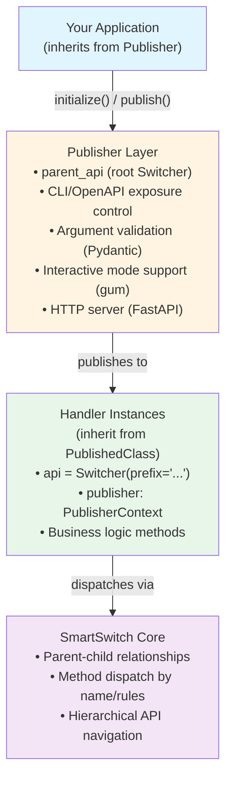
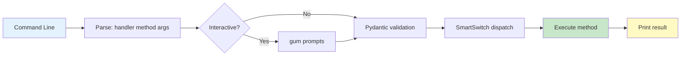
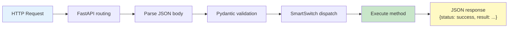
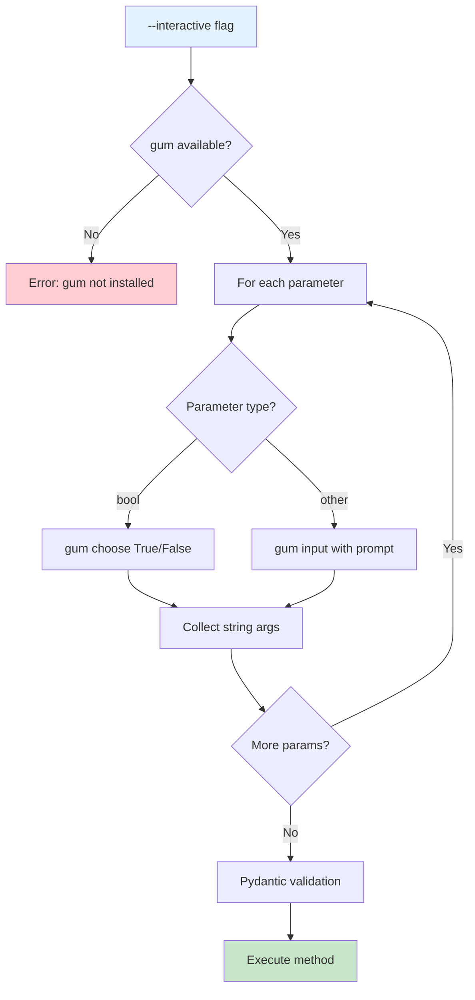
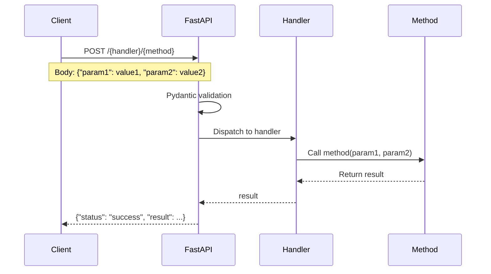

# Architecture

## Overview

smpub follows a clean layered architecture that separates concerns and provides flexibility in how applications are exposed.

## Layered Architecture



## Core Components

### Publisher

**Role**: Application orchestrator

**Responsibilities**:
- Register handlers with `publish()`
- Control CLI/OpenAPI exposure
- Create root Switcher (`parent_api`)
- Inject PublisherContext into handlers
- Run CLI or HTTP mode

**Key Methods**:
- `__init__()` - Creates parent_api, calls initialize()
- `initialize()` - Subclass hook for handler registration
- `publish()` - Register handler with exposure control
- `run()` - Auto-detect or explicit mode selection
- `_run_cli()` - CLI execution with Pydantic validation
- `_run_http()` - FastAPI server with Swagger UI

### PublishedClass

**Role**: Handler base class (mixin)

**Responsibilities**:
- Provide `publisher` slot for context injection
- Allow handlers to use `__slots__` for memory efficiency

**Usage**:
```python
class MyHandler(PublishedClass):
    __slots__ = ('data',)  # Your slots
    api = Switcher(prefix='my_')

    # publisher slot provided by PublishedClass
```

### PublisherContext

**Role**: Context object injected into handlers

**Responsibilities**:
- Provide access to publisher functionality
- Enable API introspection

**Key Methods**:
- `get_api_json()` - Extract API schema for handler

**Access Pattern**:
```python
@api
def my_method(self):
    # Access publisher context
    schema = self.publisher.get_api_json()
```

## Data Flow

### CLI Mode Flow



### HTTP Mode Flow



## Validation Layer

### Pydantic Integration

smpub uses Pydantic v2 for automatic parameter validation:

1. **Model Generation**: Create Pydantic model from method signature
2. **Type Conversion**: Convert CLI strings to proper types
3. **Validation**: Validate all parameters
4. **Error Handling**: Format validation errors for user

**Supported Types**:
- `str` - String values
- `int` - Integer with parsing
- `float` - Floating-point with parsing
- `bool` - Boolean with "True"/"False" parsing
- Optional with defaults

**Example**:
```python
@api
def add(self, a: int, b: int) -> int:
    return a + b

# CLI: "10" "20" → int(10) + int(20) → 30
```

## Interactive Layer

### gum Integration

Optional layer for user-friendly parameter input:

1. **Type-aware Prompts**: Different prompts for different types
2. **Default Display**: Show default values
3. **Boolean Choices**: Menu selection for bool params
4. **Validation**: Validate before execution

**Flow**:



## HTTP Layer

### FastAPI Integration

HTTP mode creates a FastAPI app dynamically:

1. **App Creation**: Generate FastAPI app from publisher
2. **Route Generation**: POST endpoint for each method
3. **Validation**: Use existing Pydantic validation
4. **OpenAPI**: Automatic schema generation
5. **Swagger UI**: Interactive documentation at `/docs`

**Endpoint Pattern**:



## Registry System

### Local Registry (`.published`)

Project-specific app registry:
- JSON file in project directory
- Maps app names to paths
- Used by `smpub` CLI

### Global Registry (`~/.smartlibs/publisher/registry.json`)

System-wide app registry:
- JSON file in home directory
- Global app access
- Shared across projects

## Design Principles

### 1. Separation of Concerns

- **Handlers**: Business logic only
- **Publisher**: Orchestration and exposure
- **Validation**: Separate Pydantic layer
- **Interactive**: Optional gum layer
- **HTTP**: Separate FastAPI layer

### 2. Convention over Configuration

- Auto-detect CLI vs HTTP mode
- Automatic Pydantic model generation
- Automatic route generation
- Standard prefix patterns

### 3. Progressive Enhancement

- Core: CLI with basic arguments
- +Pydantic: Type validation
- +gum: Interactive mode
- +FastAPI: HTTP/API mode
- Each layer is optional

### 4. SmartSwitch Foundation

- All dispatch goes through SmartSwitch
- Parent-child relationships for hierarchy
- Consistent API structure
- Rule-based method selection

## Extension Points

### Custom Validators

Add custom Pydantic validators:

```python
from pydantic import validator

@api
def my_method(self, email: str):
    # Pydantic will validate
    pass
```

### Custom Routes

Override route generation:

```python
from smpub.http import create_fastapi_app

app = create_fastapi_app(publisher)
# Add custom routes
app.get("/health")(lambda: {"status": "ok"})
```

### Custom Interactive Prompts

Extend interactive module:

```python
from smpub.interactive import prompt_for_parameter

# Custom prompt logic
```

## Performance Considerations

### Memory

- Use `__slots__` in handlers (PublishedClass provides publisher slot)
- Handlers are singleton instances per publisher

### Validation

- Pydantic models cached per method
- Validation happens once per invocation
- Type conversion is fast (native Python)

### HTTP

- FastAPI is async-capable (though handlers are sync)
- Uvicorn with standard extensions for production
- Each request validated independently

## Future Architecture

### Planned Enhancements

1. **Async Handlers**: Support for async methods
2. **WebSocket Support**: Real-time endpoints
3. **Plugin System**: Custom validation/transformation
4. **Multi-Handler Routes**: Compose multiple handlers
5. **GraphQL**: Alternative to REST API

### Compatibility

- Backward compatible within major versions
- SmartSwitch upgrades tracked
- Pydantic v2 required (v1 not supported)
